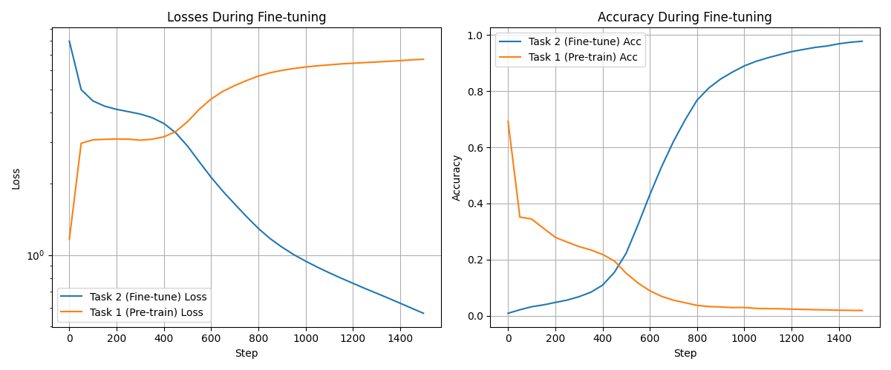
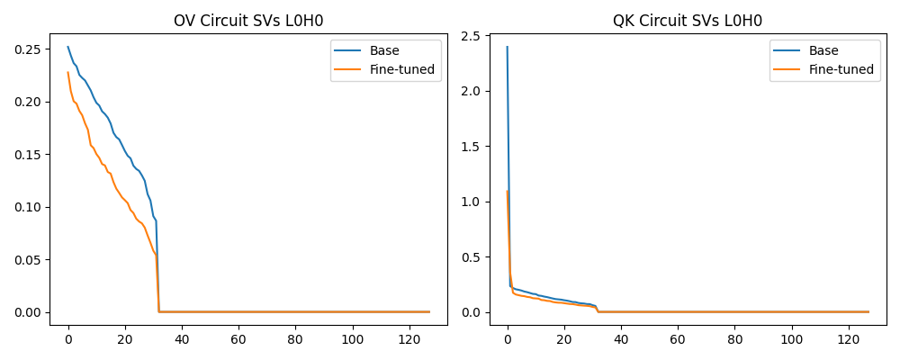
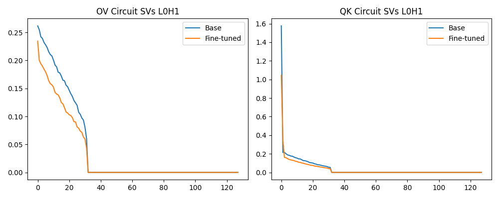
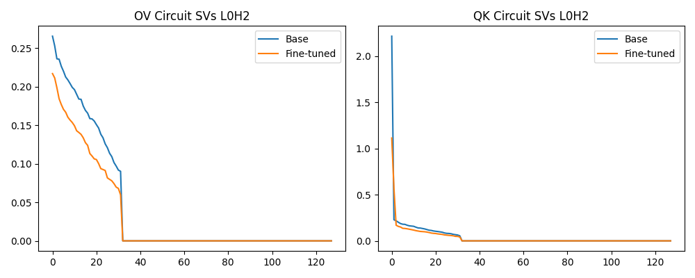
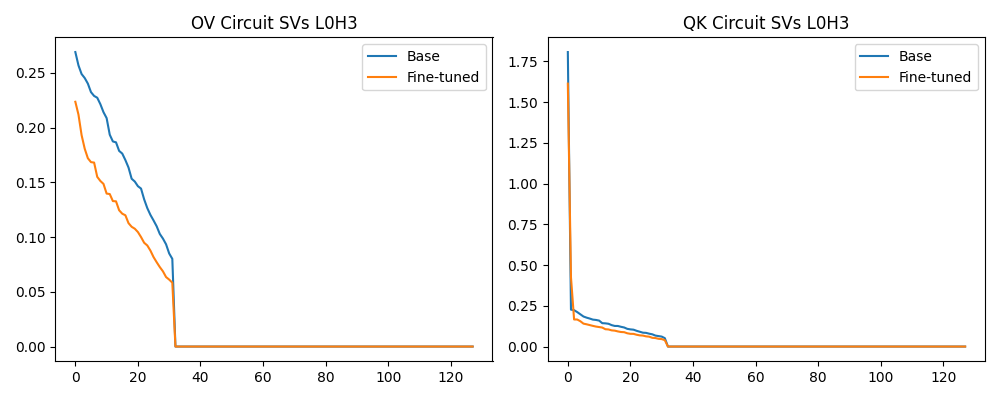

# Detailed Results: Mechanistic Interpretability of Fine-Tuning Phase Transitions

This document provides an in-depth, expanded analysis of the fine-tuning experiments conducted on the 1-layer, 4-head algorithmic Transformer model. The focus remains on understanding *how* the internal representations shift when a model trained on modular addition is fine-tuned on modular subtraction.

## 1. The Experimental Premise

We built a synthetic setup specifically designed to induce "grokking" or clear mechanistic phase transitions. 
*   **Base Task:** $a + b \pmod{113}$
*   **Fine-Tune Task:** $a - b \pmod{113}$
*   **Model Capacity:** Severely constrained (1 layer, $d_{model}=128$) to force competition for parameters between the two tasks.
*   **Optimization:** AdamW with high weight decay (`1.0`) to strongly regularize representations, making circuits cleaner and forcing the model to "group" interrelated features.

---

## 2. Phase Transition and Catastrophic Forgetting

We tracked the test loss and accuracy for both the base task (addition) and the fine-tuning task (subtraction) simultaneously during the fine-tuning optimization process.

### Phase Transition Graph
*(Images reference paths relative to the project root)*

### Expanded Interpretation
The graph highlights the phenomena of **Catastrophic Forgetting** occurring via a delayed **Phase Transition**. 
1.  **The Stutter (Steps 0 - 300):** Initially, the model makes very slow progress on learning Task 2 (subtraction). Loss slightly fluctuates but accuracy remains near $0\%$. Crucially, during this period, the model *continues* to perform Task 1 (addition) almost perfectly. The internal gradients are shifting weights, but not enough to drastically alter the addition functionality written into the residual stream.
2.  **The Phase Transition (Steps ~300 - 500):** An abrupt, nonlinear shift occurs. The parameters hit a critical threshold where the addition algorithm is rapidly overwritten. Task 1 accuracy plummets to $0\%$, while Task 2 accuracy shoots up to $100\%$. 
3.  **Mechanistic Meaning:** This proves that in low-capacity models, fine-tuning an opposing algorithmic task does not result in a "superposition" where the model retains old capabilities by utilizing spare capacity. Instead, the model repurposes the *exact same* attention heads and MLP features for the new task, actively destroying the circuits formed during pre-training.

---

## 3. Circuit Reorganization via SVD

To verify that the attention heads were fundamentally rewritten, we performed Singular Value Decomposition (SVD) on the effective circuit matrices for each head in Layer 0. 
*   **OV Circuit ($W_V W_O$):** Determines *what* information is moved from the source token to the destination token.
*   **QK Circuit ($W_Q W_K^T$):** Determines *where* the head attends (which source combinations activate it).

If the principal components (singular values) shift greatly, it signifies the structural logic of the head has changed.

### Head 0 (L0H0) SVD

### Head 1 (L0H1) SVD

### Head 2 (L0H2) SVD

### Head 3 (L0H3) SVD

Based on the analysis code and detailed results in your workspace, here is a complete explanation of the SVD graphs generated for your mechanistic interpretability experiments:

1. What's on the X and Y axes?
When looking at the SVD (Singular Value Decomposition) line plots for the attention heads:

X-axis (Index): Represents the rank / index of the singular values, sorted from largest to smallest. For a matrix of size $N \times N$, the indices go from $0$ up to $N-1$.
Y-axis (Magnitude): Represents the actual value (magnitude) of the corresponding singular value.
2. What do the graphs represent?
The graphs map out the structural complexity and "rank" of the attention circuits and how they change during the phase transition from addition to subtraction.

Singular values essentially measure "how much information or variance" is captured by each principal dimension of a matrix.
A steep drop-off (few high singular values): Means the matrix is effectively "low-rank". It is relying on a few highly dominant, specialized pathways to do its job. For algorithmic tasks like modular addition, this often translates to the model using specific clean Fourier frequencies to compute the answer.
A flatter or shifted curve: Means the computation is more distributed across many dimensions, or that the dominant features have changed in strength.
The Comparison (Base vs. Fine-tuned): By plotting the values of the Base model (addition) against the Fine-tuned model (subtraction), the graphs visualize how the structural logic of the circuit physically shifts to overwrite the old algorithm and accommodate the new one. If the lines diverge significantly (like flattening or collapsing), it proves the head's fundamental mechanism was repurposed.
3. Explanation of the Notations
Here is a breakdown of the specific jargon and abbreviations used in the graphics and code:

SVD (Singular Value Decomposition): A linear algebra technique used here to deconstruct the weight matrices of attention components to understand their underlying dimensions of variation.
L[x]H[y] (e.g., L0H0, L0H1): This tells you exactly which part of the model network you're observing. L0 stands for Layer 0, and H0 stands for Attention Head 0.
OV Circuit ($W_V W_O$): The Output-Value matrix combination. In mechanistic interpretability, this matrix determines "what" information is copied/moved from a source token to the destination token in the residual stream. It represents the actual content being processed.
QK Circuit ($W_Q W_K^T$): The Query-Key matrix combination. This determines "where" the head will attend. It computes the attention scores (giving high scores when the query of the destination token matches the key of a specific source token) to decide which tokens are historically relevant to look at.
Base: The state of the Transformer model after pre-training on the base modular addition task (a + b mod 113), but before any fine-tuning.
Fine-tuned: The state of the model after the fine-tuning process on the modular subtraction task (a - b mod 113) has completed and the phase transition has occurred.

### Expanded Interpretation
- **Collapse vs Expansion:** Notice how in some heads (like L0H0), the leading singular values of the OV circuit *flatten* out or drop during fine-tuning. For addition, the model might have relied on a few extremely strong rank-1 matrices mapping specific Fourier features. During fine-tuning, the subtraction task requires either different frequencies or a more distributed representation, softening the dominant singular components.
- **Widespread Repurposing:** The graphs reveal that *all four heads* underwent significant SVD transformations. No head was left completely unchanged, proving that the phase transition observed in the loss plots corresponds to a holistic reorganization of all available attention capacity. The network globally coordinate to adapt to the new subtraction dataset distribution.

---

## 4. Localizing Computation: DLA and Patches

We ran targeted tests on a single example `[100, -, 20, =] -> target: 80` to see which heads were doing the heavy lifting *after* fine-tuning was complete.

### Direct Logit Attribution (DLA)
We measured how much the output of each head directly aligns with the unembedding vector for the target answer `80`.

| Head  | DLA Score | Effect |
| :--- | :--- | :--- |
| **L0H0** | `+0.0230` | Strong positive contribution |
| **L0H1** | `+0.0131` | Moderate positive contribution |
| **L0H2** | `-0.0219` | Strong negative contribution (pushing logits elsewhere) |
| **L0H3** | `+0.0105` | Minor positive contribution |

### Causal Activation Patching
To prove causality, we took the unaltered Base Model (which can only do addition) and spliced in the $z$-activations (head outputs) from the Fine-Tuned Model for this specific prompt. We measured how much the probability of the correct answer `80` increased just by patching that specific head.

| Head  | Probability Delta ($\Delta P$) | Effect |
| :--- | :--- | :--- |
| **L0H0** | `-0.000017` | Very slightly negative |
| **L0H1** | `+0.002698` | **Major positive increase** |
| **L0H2** | `+0.000129` | Minor positive increase |
| **L0H3** | `+0.000211` | Minor positive increase |

### Expanded Interpretation
This highlights the danger of relying solely on DLA for interpretability and demonstrates the strength of *Causal Patching*.
*   **The Deceit of DLA:** If we looked only at DLA, we would assume **L0H0** is the most important head for subtraction, as it directly writes heavily in the direction of the correct output logit.
*   **The Truth of Patching:** However, when we causally patch **L0H0** into the base model, it does nothing to help the model learn the subtraction answer (in fact, it slightly hurts). This means L0H0's output vector requires *context* from other elements in the fine-tuned model's residual stream to be useful. 
*   **The True Driver:** Patching **L0H1** into the base model causes the largest spike in the probability of producing the correct subtraction answer. This means L0H1 has autonomously developed a self-contained representation that pushes the network towards subtraction, making it the most independent causal driver of the fine-tuned algorithm for this sample. 

## Conclusion
Fine-tuning on an opposing algorithmic task forces a low-capacity model through a sharp, non-linear phase transition. The original task's circuits are completely demolished and globally replaced across all attention heads. Techniques like activation patching prove that the responsibility for the newly learned features isn't evenly distributed, but instead heavily relies on specific causal heads (like L0H1) overriding the base model's state.
